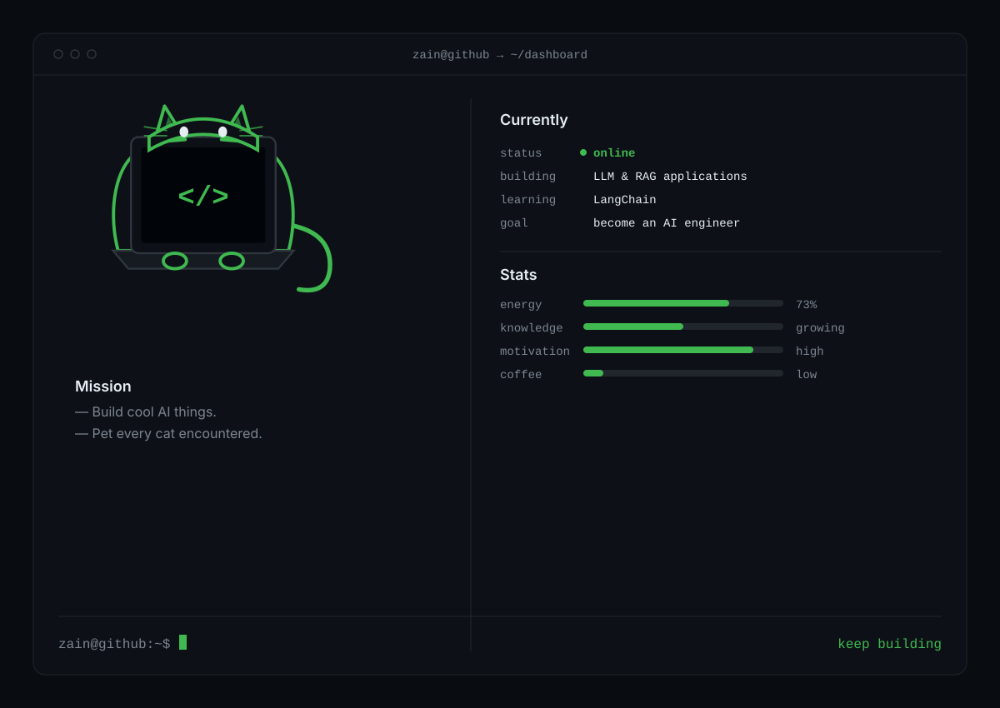

<p align="center">

</p>

---

# `system_profile`

```bash
STATUS          :: ONLINE

ROLE            :: Computer Science Undergraduate (Data Science)

FOCUS           :: Large Language Models
                   Retrieval-Augmented Generation
                   Artificial Intelligence
                   Data Structures & Algorithms

CURRENT_TASK    :: Building LLM Applications
                   Learning LangChain
                   Solving LeetCode

LANGUAGES       :: Python
                   C++
                   Java

TOOLS           :: Git
                   GitHub
                   VS Code
```

---

## `technology_stack`

<p align="left">
  
</p>

### Currently Exploring

`LangChain` • `LLMs` • `RAG`
---

# `current_mission`

```text
[✓] Learn Python
[✓] Learn Git & GitHub
[ ] Master LangChain
[ ] Build Production-Ready RAG Systems
[ ] Build AI Projects
[ ] Solve 500+ LeetCode Problems
[ ] Crack GATE CSE
```

---


## terminal_dashboard

<p align="center">
  
</p>
---

```console
$ logout

Session terminated.
```

## Contribution Snake

<div align="center">
  <picture>
    <source media="(prefers-color-scheme: dark)" srcset="https://github.com/BLUETOID/BLUETOID/blob/output/github-snake-dark.svg" />
    <source media="(prefers-color-scheme: light)" srcset="https://github.com/BLUETOID/BLUETOID/blob/output/github-snake.svg" />
    
  </picture>
</div>
